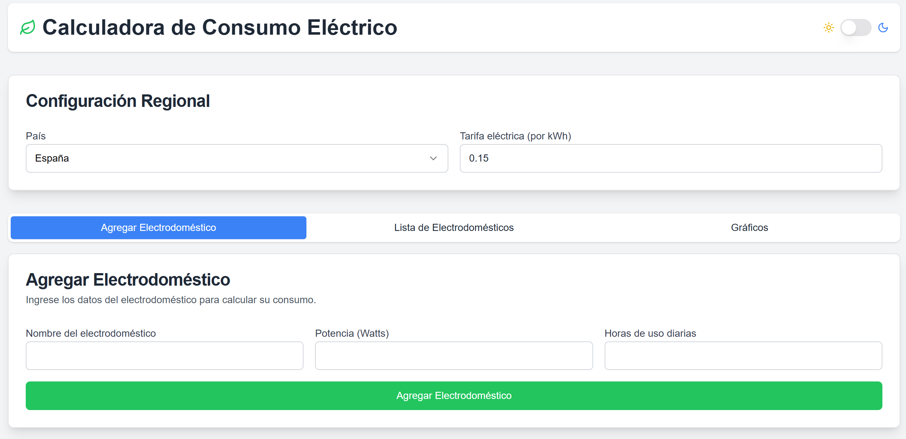

# Calculadora de consumo eléctrico

## Introducción

La calculadora de consumo eléctrico es una herramienta en línea que te permite calcular el consumo eléctrico de tus electrodomésticos y obtener un estimado del costo mensual.

## Uso

1. Un formulario para ingresar los datos de los electrodomésticos (nombre, potencia en watts y horas de uso diarias).
2. Una tabla que muestra los electrodomésticos agregados, incluyendo su consumo mensual en kWh.
3. La capacidad de agregar y eliminar electrodomésticos de la lista.
4. Un campo para ingresar la tarifa eléctrica local.
5. Un resumen que muestra el consumo total mensual en kWh y el costo estimado basado en la tarifa ingresada.
6. gráficos interactivos que muestren el consumo energético y los costos en diferentes periodos de tiempo (diario, semanal, mensual).

### Agregar electrodomésticos

1. Ingresa el nombre del electrodoméstico en el formulario.
2. Ingresa la potencia en watts del electrodoméstico.
3. Ingresa las horas de uso diarias del electrodoméstico.
4. Haz clic en "Agregar" para agregar el electrodoméstico a la lista.

### Calcular consumo mensual

1. Ingresa la tarifa eléctrica local en el campo correspondiente.
2. Haz clic en "Calcular" para obtener el consumo mensual en kWh y el costo estimado.

## Características

* Agregar y eliminar electrodomésticos de la lista.
* Calcular el consumo mensual en kWh.
* Estimar el costo mensual basado en la tarifa eléctrica local.

## Tecnologías utilizadas

* React
* Next.js

## Guia

Para usar este proyecto, necesitarás:

1. Configurar un proyecto Next.js con TypeScript.
2. Instalar y configurar los componentes de shadcn/ui.
3. Colocar este componente en un archivo dentro de la carpeta `app` de tu proyecto Next.js.

## Contribuciones

Si deseas contribuir al proyecto, por favor reporta bugs o solicita características nuevas en [nuestro repositorio de GitHub](https://github.com/IBER-DEV/Calculadora-de-consumo-electrico).

